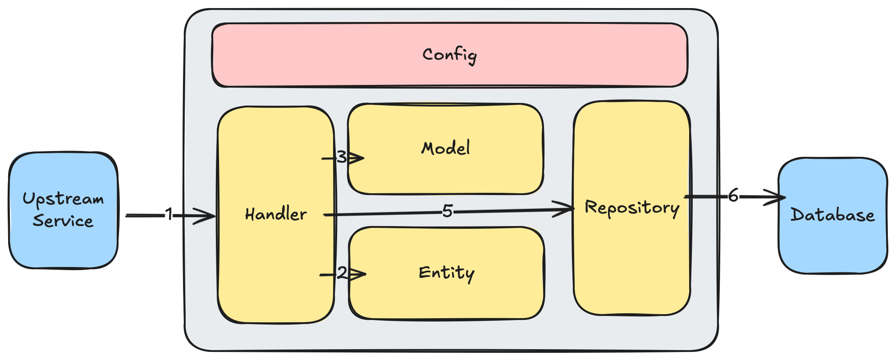
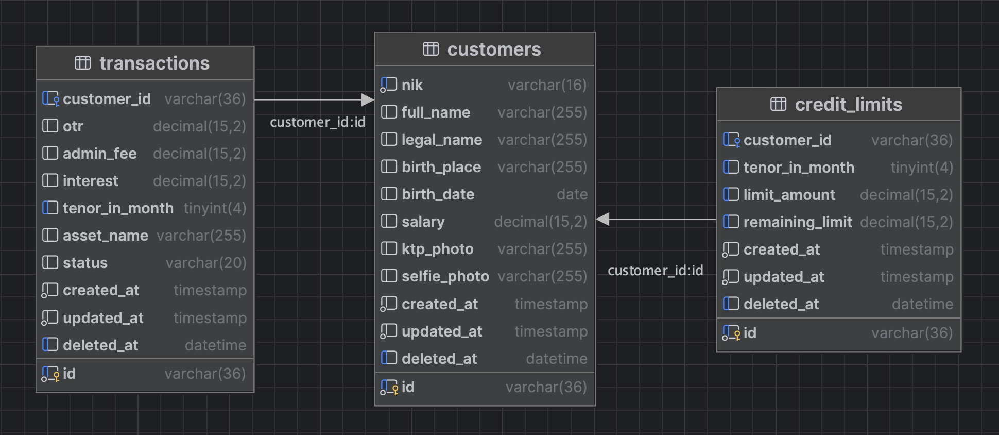

# MultiFinance API




## Prerequisites

- Go 1.24 or higher
- MySQL

## Configuration

Before you can run the API, you will need to configure it by following these steps:
- Copy `.env.example` to `.env`
```
$ cp .env.example .env
```
Adjust the values in the `.env` file to match your environment.

## Dependency

Before running need to download dependency, with command:
```
$ go mod download && go install github.com/swaggo/swag/cmd/swag@vlatest
```

## Generating the docs

After setting up the language and cloning the project, we have to install `swag` command to generate the swagger
documentation from the comment we made for each function. We run this on the project root.

    $ go get github.com/swaggo/swag/cmd/swag

Then, we generate `docs` folder.

    $ swag init

After that, we can see `docs` folder generated, we can access the documentation via this
url http://localhost:{port}/swagger/index.html.

Swag command must be run after we register new function. If we have already written the function and the comment, but we
didn't run the swag command, it won't be shown on the documentation page.

## Build & Run

We can build it first then run the binary.

    $ go build -o multifinance-api
    $ ./multifinance-api

Or we can run it with `go run` command

    $ go run main.go

Or if you want to run app for seeding only, you can run with this command:

    $ go build -o multifinance-api
    $ ./multifinance-api seed

It will build the application for reset user only.

*We can use any name for the generated binary, but if you use another name, please add it to `.gitignore`. Please do not upload the generated binary to the repository.*
